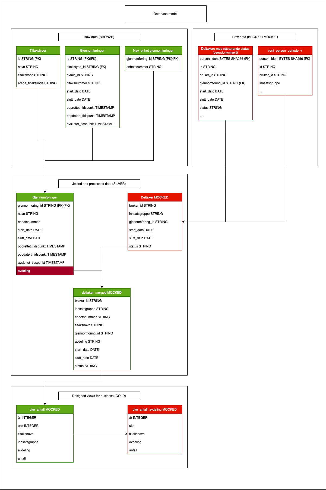

# Utfordringer og mangler i datagrunlaget

Fargene i modellen skal egentlig representere ikke mock vs. mock data, men noe går feil med fargene i konvertering til bildefil...

### Mangler i gjennomføringer
1. Bare gruppetiltak.
- Tiltak er et bredt spekter som også kan være unikt for bare ett kontor. Dette gjør at det må gjøres fullstendig dynamisk å hente til dashboard, det er det kanskje nå, men ikke helt sikkert.
- Må finne resten av tiltakene.
- Må kunne knytte til tiltak arrangert av bedrifter.
2. Enhetsnummer
- Kjent problem er at et enhetsnummer er knyttet til ting som Nav Bærum og f.eks Nav Vest-Viken. En deltaker kan være tilknyttet Vest-Viken, men bruker fortsatt av tiltakskapasiteten til Nav Bærum. Vi har per nå ingen måte å skille de fra hverandre, så vi mister mange i tellingen.

### Mangler i deltakere
**Data basert på Team Effekt: `vent_person_periode_v`**
1. Bare første tiltak
- Denne tabellen handler om å dokumentere ventetider på tiltak. Slik jeg forstår det betyr dette at man bare dokumenterer det FØRSTE tiltaket en deltaker har registrert seg på. Som vil si at den ikke kan brukes til å dokumentere utvikling over historie.
- Usikkert om innsatsgruppene er det samme som Abdikarim har beskrevet.
- Dataen er beskrevet i måneder, mens vi helst ønsker ukesperspektiv.
**Data basert på Team Komet: `amt_tiltak_datastream_amttiltak_deltaker_siste_status_view`**
2. Denne tabellen kan knyttes til gjennomføringer. Men har ikke innsatsgrupper. Så må knyttes til innsatsgrupper på et annet vis.
3. Vi finner ikke en kobling til avdelinger eller veiledergrupper. Dette er sentralt for funksjonaliteten av dashboardet. Veiledergrupper tilknyttet en deltaker kan være i endring, så må kunne oppdateres dynamisk over tid.

### Problemer med størrelsen på dataen

Hver uke må vi kunne se hvor mange mennesker som er: **på ett tiltak** som er tilknyttet **en avdeling** som er kartlagt som del av **en innsatsgruppe**. Kombinasjonen av disse kan bety at man trenger ekstremt mange rader for bare én uke. I eksempelet vårt har vi 240 rader for hver uke. Med flere innsatsgrupper og tiltakstyper vil dette tallet gro eksponensielt.

I vårt eksempel har vi bare ét kontor sine tiltak fra 1. Januar 2022 til 27. Juli 2025. Bare her har vi over 44000 rader, hvor det i realitet er mange fler.
Dette vil bety at om det skal fungere for alle kontorer over lengre tid, vil mengden data bli veldig stor.

For å kunne prosessere denne typen data har vi tenkt at en ukentlig schedulert oppgave kan regne ut radene for den forige uken.
